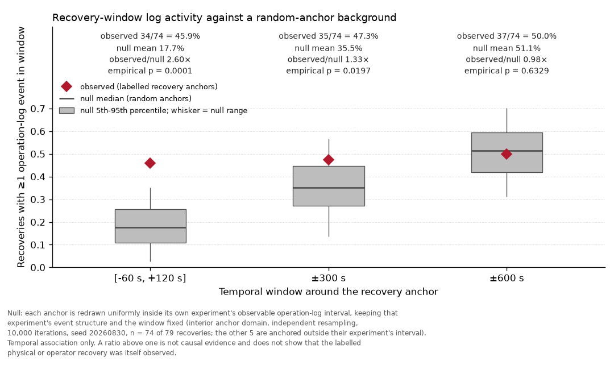

# Auditing physical evidence in laboratory automation logs

**Can software logs prove that a commanded physical action actually occurred?**

A small, reproducible audit of two public laboratory-automation datasets: a Chemspeed
run from Flex-Cat, and expert-labelled recoveries from a batch-distillation plant.

## Key results

| Finding | Result |
| --- | ---: |
| Chemspeed `type="operation"` events that pair cleanly | **986 / 986** |
| Transfer endpoints where reported `actualVolume` equals requested volume | **60 / 60** |
| Labelled recoveries with nearby parseable operation-log activity, `[-60 s, +120 s]` | **34 / 79** (43.04%) |

Nearby log activity is an **observability proxy, not evidence that the physical or
operator recovery was itself observed** — and a silent window is not evidence that no
intervention occurred. `actualVolume` equality compares a *reported field*; if that
value is a controller readback, its name alone does not say so.

### Is that activity unusual?

34/79 only says *some* row is nearby. To test whether that beats background, each
labelled anchor is replaced by a random anchor inside the same experiment's own log,
holding the window and that experiment's event density fixed (10,000 iterations, seed
`20260830`). 5 recoveries are anchored outside their logged interval entirely, so no
window can match them — unanswerable rather than negative, and outside the comparison.
The other 74:

| Window | Observed | Background | Ratio | Empirical *p* |
| --- | ---: | ---: | ---: | ---: |
| `[-60 s, +120 s]` | 34/74 = 45.9% | 17.7% | **2.60×** | 0.0001 |
| `±300 s` | 35/74 = 47.3% | 35.5% | 1.33× | 0.020 |
| `±600 s` | 37/74 = 50.0% | 51.1% | 0.98× | 0.633 |

At the original window, activity really is concentrated around recovery labels — 2.6×
random anchoring. That vanishes as the window widens: at `±600 s` the observed value
is indistinguishable from chance, so widening buys only background. This is temporal
association, not causal evidence — and since the anchor is the *end of the
perturbation*, some of the concentration may simply record the operator action that
ended it. Removing those row types leaves the enrichment intact
([`METHODOLOGY.md`](METHODOLOGY.md) §7.5–7.6).



## Why it matters

The audit keeps three records separate: a **requested software action**, a
**controller or device readback** (where that origin is established), and
**independent evidence of physical execution**. A completed command can coexist with
absent physical-effect evidence, and a missing log row does not prove the action never
happened — so `RecoveryLabel`, `RecoveryEvidence`, and `RecoveryOutcome` stay distinct.

## Reproduce

Python 3.12, [uv](https://docs.astral.sh/uv/), and the three pinned archives from
[`data/README.md`](data/README.md):

```powershell
uv sync --frozen --group dev
uv run --frozen python scripts/reproduce.py
```

Reruns are byte-stable; `results/SHA256SUMS.txt` pins all five artefacts, the figure
included. Tests: `uv run --frozen python -m pytest`; notebook:
`uv run --frozen python scripts/execute_notebook.py`.

## Scope

One Chemspeed run, one plant. Matching is by time of day; midnight rollover is not
inferred. The 60 transfer rows are deterministic parsing, not a manual review
([`MISSING_INPUTS.md`](MISSING_INPUTS.md)). CI runs on synthetic fixtures, since the
upstream archives are not redistributed here: a green CI run does **not** mean the
real-data audit was re-executed.

## Deeper methodology

- [`METHODOLOGY.md`](METHODOLOGY.md) — pairing, `Decimal` comparison, deduplication,
  windows, null construction and sensitivity variants, determinism, limitations
- [`data/README.md`](data/README.md) — provenance, licences, downloads
- [`notebooks/audit.ipynb`](notebooks/audit.ipynb) — same results, committed outputs

## Citation and license

Metadata in [`CITATION.cff`](CITATION.cff). Repository **code and original prose** are
MIT-licensed ([`LICENSE`](LICENSE)); that licence does **not** cover the third-party
datasets or tables derived from them, which retain CC BY 4.0 terms.
